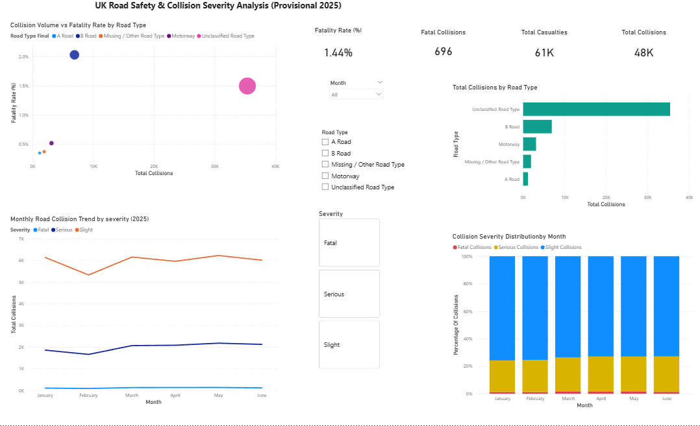
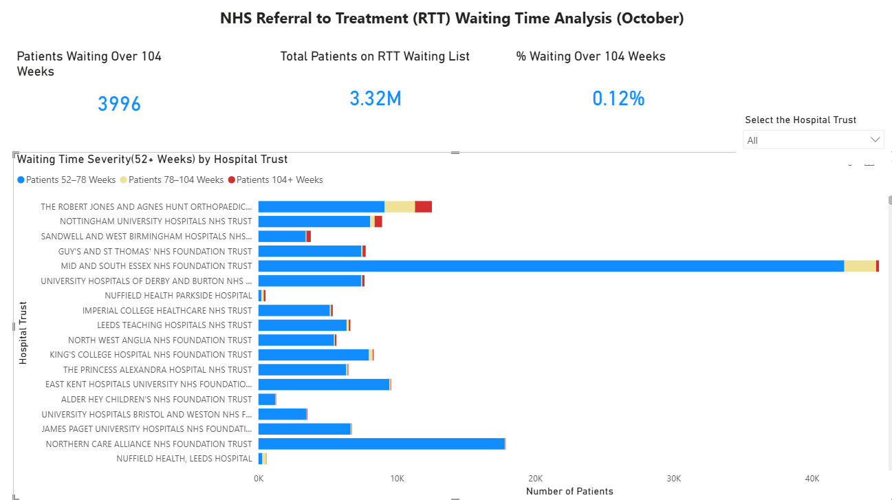
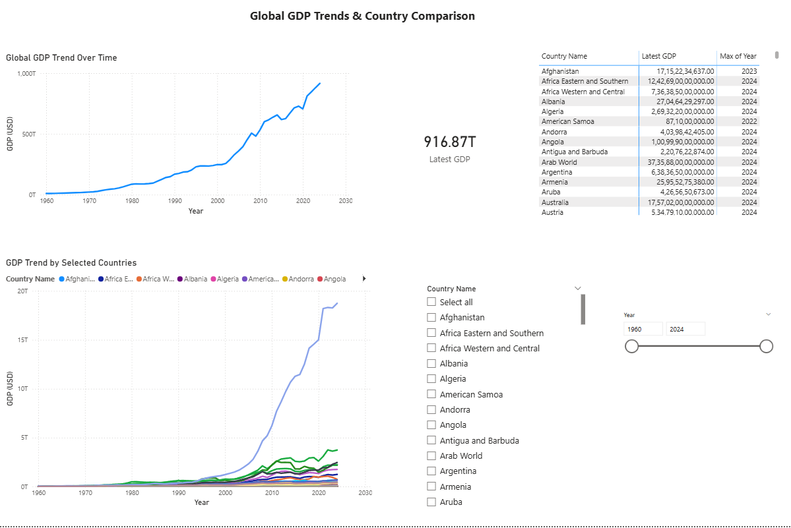

# Greeshma Balachandran — Data Analytics Portfolio

Welcome to my data analytics portfolio.  
This page showcases selected projects demonstrating data cleaning, validation, KPI reporting, and dashboard development using Power BI.

---

## 📊 Project 1: Road Safety & Collision Analysis

**Objective:**  
Analyse road collision data to identify trends, severity patterns, and risk areas.

**Key Work:**
- Data ingestion and cleaning
- Data quality checks
- KPI development
- Interactive dashboards

**Tools:** Power BI, Power Query, DAX

---

## 📊 Project 2: Healthcare Waiting Time Analysis

**Objective:**  
Monitor waiting-time performance and identify long-wait patterns.

**Key Work:**
- KPI creation
- Data validation
- Performance reporting

**Tools:** Power BI, DAX , Power Query

---

## 📊 Project 3: Economic Indicators Analysis

**Objective:**  
Analyse economic performance trends using structured datasets.

**Key Work:**
- Data transformation
- Time-series analysis
- Executive reporting

**Tools:** Power BI, Power Query ,DAX

---

## 📬 Contact
Email: greeshma.bal92@gmail.com  

